# Stable Audio Open – Inference Speedup

## Setup

- **Model**: `stabilityai/stable-audio-open-1.0`
- **GPU**: NVIDIA GeForce RTX 3070 (8 GB VRAM)
- **Attention**: PyTorch SDPA Flash Attention backend
- **Precision**: float32 (TF32 disabled)
- **Sampler**: dpmpp-3m-sde, 100 steps, cfg_scale=7

## Baseline Timing (latent size 1024, ~47.6s audio)

Offloading DiT + T5 to CPU was required before VAE decode to fit in 8 GB VRAM.
Offloading time is **excluded** from the measurements below.

| Version | Run                                   | T5    | DiT    | VAE   | End-to-end |
|:--------|:--------------------------------------|------:|-------:|------:|-----------:|
| v1      | Baseline                              | 0.36s | 42.98s | 1.22s | 44.55s     |
| v2      | v1 + `torch.compile`                  | 0.01s | 40.23s | 1.22s | 41.46s     |
| v3      | v1 + Cross-attention KV cache         | 0.36s | 42.49s | 1.22s | 44.07s     |
| v4      | v3 + Fused residual-add + LayerNorm   | 0.36s | 42.00s | 1.22s | 43.58s     |
| v5      | v4 + Fused SwiGLU                     | 0.36s | 41.18s | 1.22s | 42.76s     |
| v6      | v5 + Fused RoPE                       | 0.36s | 40.34s | 1.22s | 42.02s     |

Relative to baseline (`v1`), `v6` improves end-to-end by about **2.53s (~5.7%)** and DiT time by about **2.64s (~6.1%)**.

Notably, `v6` DiT time (**40.34s**) is within **0.11s** of `torch.compile` (**40.23s**), achieved entirely through targeted Triton kernel fusions and a KV cache — with no compilation overhead, no graph-break constraints, and full Python-level debuggability.

## DiT Inference Speed Up

- v3. Implement cross-attention KV caching: pre-compute K,V projections once per prompt and reuse across denoising steps/layers; bypass `to_kv` and `repeat_interleave` in cross-attention.
- v4. Write Triton fused residual-add + LayerNorm kernel for long-sequence blocks (`x += sublayer_out; ln(x)`) on `(2, 1025, 1536)`-class shapes.
- v5. Write Triton fused SwiGLU activation kernel (`chunk + SiLU + mul`) on post-GEMM tensors `(2, 1025, 12288) -> (2, 1025, 6144)`.
- v6. Add Triton fused RoPE `N ~ 1024`.

## Profiling Results

### v1 – Baseline

From `scripts/dit_profile/profile_table_filtered.txt`:

| Kernel | Self CUDA | Self CUDA % | # Calls |
|:-------|----------:|------------:|--------:|
| `ampere_sgemm_128x64_tn` (GEMM) | 1.724s | 82.88% | 840 |
| `flash_fwd_kernel` (FlashAttention) | 72.3ms | 3.48% | 240 |
| elementwise / LN / SiLU / cat / clone | ~330ms | ~13.6% | — |

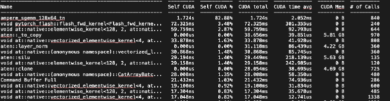

GEMM + FlashAttention together account for **~86.4%** of CUDA time. The remaining **~13.6%** is memory-bound pointwise work (layer norms, elementwise ops, SiLU, RoPE rotate). At `seq_len ~ 1025`, attention matmul is compute-bound — these are not fuse-able for large gains. Fusion opportunity is isolated to the memory-bound 13.6%.

GPU is the bottleneck (not CPU scheduling). This rules out CPU-side kernel-launch overhead as a significant factor (unlike MoE-style models), so all optimization headroom lives on the GPU memory-bandwidth side.

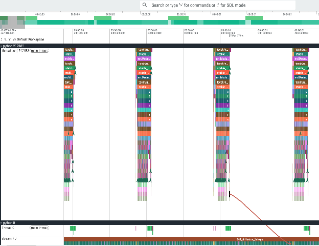

### v3 – Cross-Attention KV Cache

The cross-attention context (T5 + number tokens, shape `(2, 130, 768)`) is static across all denoising steps. In the baseline, `to_kv(context)` + GQA `repeat_interleave` (12 → 24 heads) are recomputed every layer every step.

**Profiler observation:** The baseline CPU trace shows many small ops and kernel launches per cross-attention call. GPU critical path is **~0.1 ms/call**. Across `24 layers × 99 re-runs = 2376 calls`, this amounts to **~0.2 s** that is entirely avoidable.

*Baseline CPU trace — many redundant cross-attention ops:*

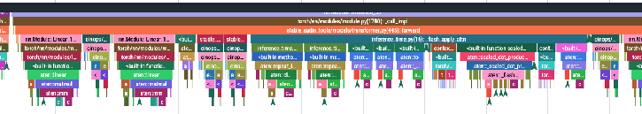

*Baseline GPU trace — critical path ~0.1 ms/call:*

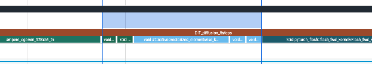

**Fix:** Pre-compute per-layer K, V once before sampling. Store as `(2, 24, 130, 64)` tensors per layer and pass cached K/V directly to FlashAttention, bypassing `to_kv` + `repeat_interleave` entirely. After the fix, all those calls disappear from the trace.

*After KV cache — cross-attention kernel calls eliminated:*

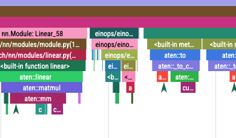

**DiT delta:** `42.98s → 42.49s` (−0.49s, ~1.1%)

### v4 – Fused Residual-Add + LayerNorm

**Profiler observation (baseline):** Two separate kernel launches per sub-block — an elementwise residual-add followed by a LayerNorm kernel — at `(2, 1025, 1536)`. Each LayerNorm call is `~86 µs` self-CUDA time.

*Baseline — two-kernel pattern (add + LayerNorm):*

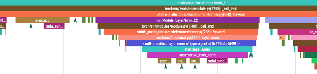


**Fix:** Single-pass Triton kernel: `residual_add_layernorm(x, sublayer_out, γ, β)` reads the input once, adds the residual, and computes norm in the same pass. Saves one full read + write round-trip of the tensor.

*After fusion — single-pass residual + LayerNorm:*

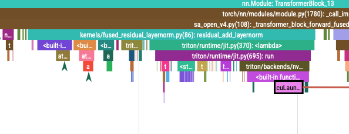


**Observed savings:** `~0.03 ms/call`. PyTorch's built-in CUDA LayerNorm is already well-optimized, so the margin is modest. Memory saving: `2 × (bytes of (2,1025,1536)) × memory_bandwidth`.

**DiT delta:** `42.49s → 42.00s` (−0.49s, ~1.2%)

### v5 – Fused SwiGLU

**Profiler observation (baseline):** After the FFN `Linear(1536 → 12288)` GEMM, two separate kernels handle the SwiGLU: `chunk` (split into gate + value) + `silu * x`. These two kernels together cost **~350 µs** per block.

*Baseline — two SwiGLU kernels (~350 µs):*

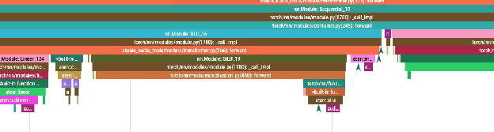


**Fix:** Single Triton kernel fusing `chunk + SiLU(gate) × value` on the post-GEMM tensor `(2, 1025, 12288) → (2, 1025, 6144)`. Eliminates the extra read/write between the two ops.

*After fusion — single SwiGLU kernel (~150 µs, ~50% reduction):*


**Observed savings:** One kernel at **~150 µs** — a **~50% reduction** for that sub-path. Same root cause as v4: total savings scale as `bytes_moved × memory_bandwidth`.

**DiT delta:** `42.00s → 41.18s` (−0.82s, ~2.0%)

### v6 – Fused RoPE

**Profiler observation:** RoPE remained a visible hotspot at **~800 µs** per call. The baseline implementation casts to fp32, splits the tensor, applies `rotate_half`, multiplies cos/sin, concatenates, then casts back — several separate elementwise ops over `(2, 1025, 1536)`.

*Baseline — fragmented RoPE ops (~800 µs):*

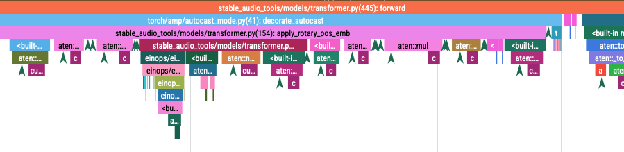

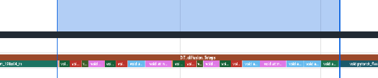

**Fix:** Single Triton kernel fusing the cast, rotate, multiply, and concatenate in one pass. Validated against baseline numerically.

*After fusion — single RoPE kernel:*

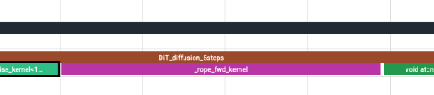

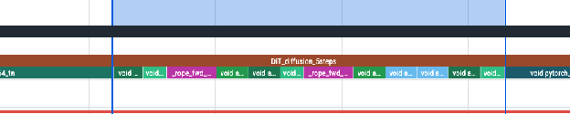

**Observed savings:** Meaningful reduction in the ~800 µs RoPE cost. Worth implementing once larger bottlenecks (GEMM, FlashAttention) are not regressed.

**DiT delta:** `41.18s → 40.34s` (−0.84s, ~2.0%)

## Priority Alignment With Plan

The measured results match the optimization order for `seq_len ~ 1024`:

1. **Cross-attention KV cache** – largest low-risk structural gain; removes static recomputation entirely
2. **Attention-path dtype/layout cleanup** – keep q/k/v in attention-friendly dtype; reduce cast/rearrange churn around SDPA
3. **Fused residual-add + LayerNorm** – modest but clean; limited by already-efficient PyTorch LN kernel
4. **Fused SwiGLU** – best per-op fusion payoff among memory-bound pointwise blocks
5. **Fused RoPE** – implement when profiler still shows it after steps 1–4

## Memory-Bound Budget: Baseline vs Optimized

From the baseline CUDA profiler, total self-CUDA kernel time was **2.080s** across all ops:

- GEMM + FlashAttention: **~86.4%** (1.796s) — compute-bound, not fuseable
- Memory-bound pointwise ops: **~13.6%** (0.284s of kernel time)

Applying that 13.6% fraction to the baseline DiT wall time:

```
Memory-bound portion of DiT wall time ≈ 42.98s × 13.6% ≈ 5.85s
```

After kernel fusions (v4 + v5 + v6), DiT improved from **42.49s → 40.34s** (using post-KV-cache as the new baseline to isolate fusion gains):

```
Fusion savings = 42.49s − 40.34s = 2.15s
% of memory-bound budget recovered = 2.15s / 5.85s ≈ 37%
```

Including the KV cache (v3), which eliminates redundant cross-attention recomputation (not a kernel fusion but still memory/compute avoidance):

```
Total DiT savings (v3→v6) = 42.98s − 40.34s = 2.64s
% of memory-bound budget recovered = 2.64s / 5.85s ≈ 45%
```

In other words, of the **~5.85s** ceiling that memory-bound ops imposed, the Triton fusions alone recovered **~37%**, and together with the KV cache the combined optimizations recovered **~45%** of that budget — leaving the remaining ~55% as future headroom (primarily `aten::clone`, `aten::reshape`, and remaining elementwise churn).

## References

- `scripts/dit_profile/profile_table_filtered.txt` – filtered kernel-level CUDA profiler table (v1 baseline)
